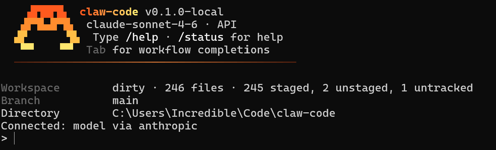

> **Fork Note:** This project is a deeply modified version based on [ultraworkers/claw-code](https://github.com/ultraworkers/claw-code). The source code can be compiled for cross-platform use (Windows / macOS / Linux). Since the author primarily uses Windows, this version focuses on optimization and adaptation specifically for that platform.

A cross-platform AI coding assistant CLI written in Rust. Binary name: `claw`.

It provides an interactive REPL that communicates with LLM providers (including Anthropic and OpenAI-compatible services), along with tools for file editing, bash execution, sub-agents, MCP servers, plugins, and slash commands.



## Remastered Edition

This is not just a simple fork—it's a **complete overhaul** of the original project. Originally described as a *"museum exhibit"*, this version has been transformed into a **production-ready tool that runs stably on Windows**.

| Feature | Details |
|--------|---------|
| **Code Size** | +27,509 lines added, -47,844 lines removed, 202 files refactored |
| **New Architecture** | Added `agents` and `plugin-types` crates; redesigned sub-agent lifecycle and plugin interfaces |
| **Cross-Platform Support** | Source code compiles for Windows / macOS / Linux; precompiled packages available for Windows x64 |
| **Runtime Improvements** | Session persistence, rule-based permission engine, full MCP lifecycle management, sandbox detection |
| **Simplified Design** | Removed 76 redundant files including Python reference implementations, RAG services, and simulation services |
| **Agent Ecosystem** | 50+ preconfigured agent definitions, 20+ Skill templates, plugin marketplace integration |
| **Code Quality** | All warnings suppressed using `clippy::pedantic`, `unsafe_code` disabled, comprehensive test suite |

<details>
<summary>📊 Detailed change statistics (only <code>rust/</code> directory)</summary>

| Metric | Value |
|--------|-------|
| Total files changed | **202** |
| Files added | **53** |
| Files removed | **76** |
| Files modified | **72** |
| Lines added | **+27,509** |
| Lines removed | **-47,844** |

**Crate structure changes:**

| Change | Crate | Description |
|--------|-------|-------------|
| Added | `agents` | Manages sub-agent lifecycle (spawn, manifest, state machine) |
| Added | `plugin-types` | Defines plugin types (config, lifecycle, MCP interfaces) |
| Removed | `claw-analog` | Simulation service from original project (not needed here) |
| Removed | `claw-rag-service` | RAG service from original project (not needed here) |

**Changes per Crate:**

| Crate | Number of changed files | Key modifications |
|-------|--------------------------|--------------------|
| `runtime` | 50 | Session management, bash execution, permissions system, MCP support, sandbox features |
| `rusty-claude-cli` | 20 | CLI entry point, terminal rendering, interaction optimization |
| `agents` | 15 | New crate for sub-agent functionality: spawning, discovery, persistence |
| `api` | 15 | LLM HTTP client, SSE communication, Provider routing |
| `plugins` | 12 | Plugin loading, marketplace integration, configuration management |
| `commands` | 6 | Refactoring of slash commands |
| `tools` | 6 | Unified interface for tool execution |
| `plugin-types` | 5 | New crate defining plugin interface types |

</details>

## Features

- **Interactive REPL** — Markdown rendering + syntax highlighting in terminal
- **Multi-Provider** — Anthropic Messages API, OpenAI-compatible endpoints, local models (LM Studio)
- **Tool System** — File ops, bash execution, grep/glob, LSP, web fetch, image handling
- **Sub-Agents** — Spawn isolated agent workers with lifecycle management
- **MCP Integration** — Full lifecycle management for Model Context Protocol servers
- **Plugins** — Builtin, bundled, and external plugin loading with marketplace support
- **Slash Commands** — `/compact`, `/agents`, `/mcp`, `/plugins`, `/skills`, etc.
- **Permission System** — Rule-based tool execution permissions with sandbox support
- **Session Persistence** — Conversation history and session resume
- **Prompt Cache** — Anthropic prompt caching for efficient API usage

## Architecture

```
rusty-claude-cli  (binary "claw")
  ├─ tools         (tool execution façade)
  │    ├─ runtime  (core engine)
  │    │    ├─ plugin-types
  │    │    ├─ plugins
  │    │    └─ telemetry
  │    ├─ agents   (sub-agent lifecycle)
  │    ├─ commands (slash commands)
  │    └─ plugins
  ├─ api           (LLM HTTP client: Anthropic + OpenAI-compat, SSE, prompt cache)
  ├─ commands
  ├─ runtime
  └─ compat-harness  (upstream manifest extraction, bootstrap plan)
```

## Prerequisites

- **Rust** (latest stable)
- **MSVC toolchain** (VS2022 with C++ workload)
- **Clang-CL** (optional, for faster compilation)

## Build

### Option A — Scripted (recommended)

```bat
rust\build.bat
```

This loads the full MSVC environment and runs `cargo build --release`.

### Option B — Manual

```bat
:: Load MSVC environment first
"C:\Program Files\Microsoft Visual Studio\2022\Community\Common7\Tools\VsDevCmd.bat" -arch=x64

cd rust
cargo build --release
```

Binary output: `rust\target\release\claw.exe`

### Lint

```bat
cd rust
cargo clippy --workspace --all-targets -- -D warnings
```

### Tests

```bat
cd rust

# All workspace tests
cargo test --workspace

# Single crate
cargo test -p runtime
cargo test -p tools
cargo test -p agents

# Single test by name
cargo test -p tools test_worker_create_with_cwd
```

## Quick Start

### Anthropic API Mode

1. Copy `start.bat` and configure your API key:

```bat
set ANTHROPIC_API_KEY=sk-ant-your-real-key
set ANTHROPIC_BASE_URL=http://127.0.0.1:1234   :: optional proxy
```

2. Run:

```bat
start.bat
```

### Local Model Mode (LM Studio / Ollama)

```bat
run_local_openai.bat
```

Or configure manually:

```bat
set OPENAI_BASE_URL=http://127.0.0.1:1234
set OPENAI_API_KEY=dummy
set ANTHROPIC_MODEL=your-model-name
```

## Configuration

### Environment Variables (`~/.claw/.env`)

Claw auto-loads `~/.claw/.env` on startup. See [`.claw/env.example`](.claw/env.example) for full reference.

```env
# LLM Provider Keys
ANTHROPIC_API_KEY=sk-ant-...
OPENAI_API_KEY=sk-...
DASHSCOPE_API_KEY=sk-...

# WebSearch (optional — falls back to Bing/Sogou scraping)
SEARCHAPI_API_KEY=your-key

# Network
HTTPS_PROXY=http://127.0.0.1:7890

# Runtime
RUST_LOG=info
DISABLE_TELEMETRY=1
```

### Settings Files (priority low → high)

| File | Level | Purpose |
|------|-------|---------|
| `~/.claw.json` | User (legacy) | Global defaults |
| `~/.claw/settings.json` | User | User-wide MCP/model/permissions |
| `$CWD/.claw.json` | Project | Project defaults |
| `$CWD/.claw/settings.json` | Project | Project core config |
| `$CWD/.claw/settings.local.json` | Local override | Not committed |

User and project settings **deep merge**, with project-level keys overriding user-level.

### Example `settings.json`

```json
{
  "model": "sonnet",
  "env": {
    "ANTHROPIC_API_KEY": "sk-ant-..."
  },
  "mcpServers": {
    "my-server": {
      "command": "uvx",
      "args": ["my-tool"]
    }
  },
  "permissions": {
    "defaultMode": "ask",
    "allow": ["Read", "Glob", "Grep"],
    "deny": ["Bash(rm -rf *)"]
  }
}
```

## Key Environment Variables

| Variable | Description | Example |
|----------|-------------|---------|
| `ANTHROPIC_API_KEY` | Anthropic API key | `sk-ant-...` |
| `OPENAI_API_KEY` | OpenAI-compatible provider | `sk-...` |
| `ANTHROPIC_BASE_URL` | API endpoint override | `http://127.0.0.1:1234` |
| `HTTPS_PROXY` | HTTP proxy | `http://127.0.0.1:7890` |
| `CLAW_WORKSPACE_POLICY` | Workspace trust policy | `allow` |
| `RUST_LOG` | Log level | `info` |
| `DISABLE_TELEMETRY` | Disable telemetry | `1` |

## File Conventions

```
.claude/              # Agent definitions, skills, plugins
.claude-plugin/       # Plugin manifests
.claw/                # Claw-specific config
  ├── settings.json   # Project settings
  ├── agents/         # Agent manifests
  ├── plugins/        # Installed plugins
  ├── sessions/       # Session data (gitignored)
  ├── skills/         # Skill definitions
  └── env.example     # Environment variable reference
.claw.json            # Legacy config (to be migrated)
AGENTS.md             # AI agent guidance
```

## License

MIT
